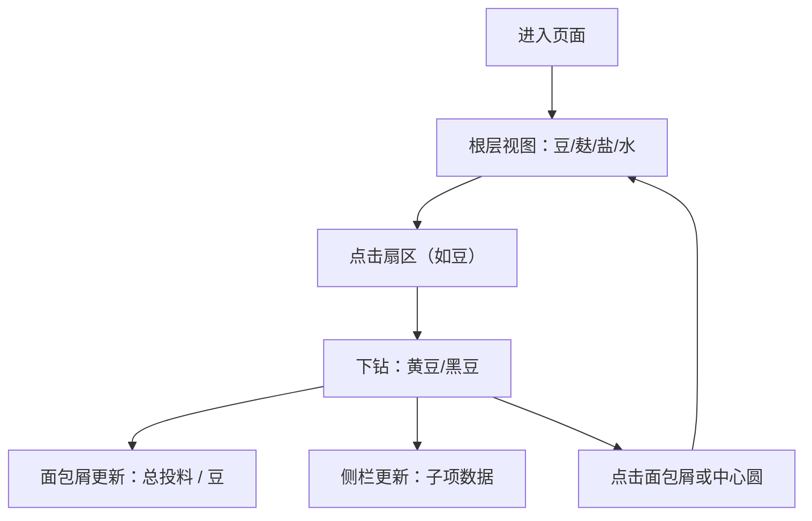

## 1. 产品概述

投料占比扇区可视化页面，帮助豆坊师傅一眼看清单批投料结构。通过交互式饼图展示投料组成，支持下钻查看子项拆分，侧栏同步显示详细数据。

- 核心价值：直观呈现批次投料结构，支持层级下钻，一目了然
- 目标用户：豆坊师傅、生产管理人员
- 使用场景：生产投料核对、配方查看、工艺培训

## 2. 核心特性

### 2.1 功能模块

1. **扇区饼图**：SVG 绘制交互式饼图，展示当前层级各投料项占比
2. **层级下钻**：点击扇区进入子项拆分视图，中心圆点击返回上一级
3. **面包屑导航**：顶栏显示当前层级路径，点击可快速返回任意上级
4. **侧栏详情**：同步展示当前层各分项的名称、重量（kg）、占比（%，一位小数）
5. **内置数据**：一批次四投料（豆/麸/盐/水），豆可拆分为黄豆/黑豆

### 2.2 页面详情

| 页面名称 | 模块名称 | 功能描述 |
|---------|---------|---------|
| 主页面 | 顶栏面包屑 | 显示层级路径，点击返回上级，最左为根 |
| 主页面 | 中心扇区饼图 | SVG 饼图，扇区可点击下钻，中心圆点击返回（根层无效） |
| 主页面 | 右侧详情栏 | 列出当前层所有分项：名称、重量 kg、占比 % |

## 3. 核心流程

用户进入页面 → 看到根层饼图（豆/麸/盐/水）与侧栏详情 → 点击「豆」扇区 → 饼图切换为黄豆/黑豆子视图 → 面包屑增加「豆」节点 → 侧栏更新为子项数据 → 点击面包屑「总投料」或中心圆 → 返回根层

## 4. 界面设计

### 4.1 设计风格

- **美学方向**：温暖质朴 / 手工匠心风格，契合豆坊传统工艺感
- **主色调**：暖米色背景（#F5EDE0），深褐色文字（#3D2B1F）
- **扇区配色**：
  - 豆：琥珀金（#D4A853）
  - 麸：麦秆黄（#E8D9A0）
  - 盐：青灰白（#C8D5D9）
  - 水：湖蓝（#7CB3D4）
  - 黄豆：浅金（#F0D070）
  - 黑豆：深棕（#5C4033）
- **字体**：标题用衬线字体（'Noto Serif SC'），正文用无衬线（'Noto Sans SC'）
- **布局**：左侧主区域饼图居中，右侧固定侧栏显示数据详情
- **动效**：扇区 hover 轻微放大，下钻/返回时扇区有过渡动画

### 4.2 页面设计概览

| 页面 | 模块 | UI 元素 |
|-----|-----|---------|
| 主页面 | 顶栏面包屑 | 斜杠分隔、可点击、当前项高亮、暖色调 |
| 主页面 | 饼图区 | 大尺寸居中、扇区标签、中心圆返回按钮 |
| 主页面 | 侧栏 | 卡片式列表、颜色圆点标识、重量/占比分两行 |

### 4.3 响应式

- 桌面端优先，侧边栏固定宽度 320px
- 移动端：侧栏移至底部，饼图自适应宽度

### 4.4 动效说明

- 扇区 hover：外扩 6px，阴影加深
- 下钻切换：旧扇区淡出收缩 → 新扇区淡入展开，300ms 缓动
- 面包屑点击：平滑过渡
- 数字变化：数字滚动动画
