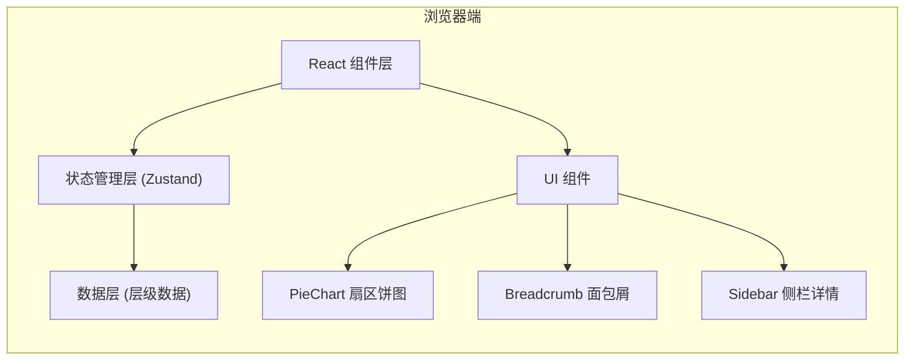

## 1. 架构设计

纯前端单页应用，无后端依赖。数据内置，状态本地管理。



## 2. 技术选型

- **前端框架**：React 18 + TypeScript
- **构建工具**：Vite 5
- **样式方案**：Tailwind CSS 3
- **状态管理**：Zustand
- **图形绘制**：原生 SVG（无需图表库，轻量且交互可控）
- **部署方式**：Docker + Nginx 静态托管

## 3. 目录结构

```
src/
├── data/
│   └── ingredients.ts      # 层级数据定义（独立模块）
├── store/
│   └── useDrillStore.ts    # 下钻状态管理
├── components/
│   ├── PieChart.tsx        # 扇区饼图组件（独立实现）
│   ├── Breadcrumb.tsx      # 面包屑导航组件（独立实现）
│   └── Sidebar.tsx         # 侧栏详情组件
├── utils/
│   └── pieUtils.ts         # 饼图计算工具
├── App.tsx                 # 主页面组装
└── main.tsx
```

## 4. 数据模型

### 4.1 层级数据结构

```typescript
interface IngredientNode {
  id: string;
  name: string;
  weight: number;        // kg
  color: string;
  children?: IngredientNode[];  // 子项（可选）
}
```

### 4.2 内置数据

根层：
- 豆：60kg（子项：黄豆 45kg、黑豆 15kg）
- 麸：20kg
- 盐：5kg
- 水：100kg

总计：185kg

## 5. 状态管理

Zustand store 管理下钻状态：

```typescript
interface DrillState {
  path: IngredientNode[];   // 当前路径，从根到当前层
  currentLevel: IngredientNode[];  // 当前层数据
  drillDown: (node: IngredientNode) => void;
  drillUp: () => void;
  goToLevel: (index: number) => void;
}
```

## 6. 核心模块职责分离

| 模块 | 文件 | 职责 |
|-----|------|-----|
| 层级数据 | `data/ingredients.ts` | 定义所有投料的层级结构、重量、颜色 |
| 扇区下钻 | `components/PieChart.tsx` | SVG 饼图渲染、扇区点击下钻、中心圆返回 |
| 面包屑导航 | `components/Breadcrumb.tsx` | 路径显示、点击跳转、层级回溯 |
| 状态管理 | `store/useDrillStore.ts` | 统一管理下钻路径和当前层数据 |

## 7. Docker 部署

- 基础镜像：nginx:alpine
- 构建阶段：node:18-alpine 构建静态资源
- 运行阶段：nginx 托管 dist 目录
- 端口：80
